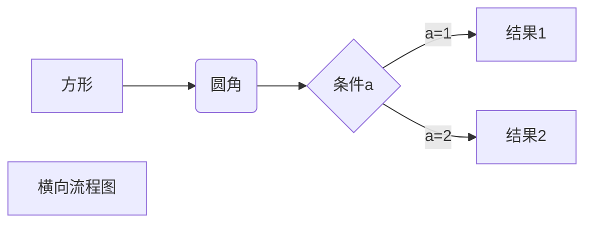

# MarkDown test
## what is markdown
## how does it work
## why we need markdown
### this is 
#### faf 
fasf dfa fad 
fasd  
fa  
*斜体文本*  
_斜体文本_  
**粗体文本**  
__粗体文本__  
***粗斜体文本***  
___粗斜体文本___  

# 分隔线

***

* * *

*****

- - -

----------


Try to put a blank line before.

---

and after a horizontal rule.  


RUNOOB.COM  
GOOGLE.COM  
~~BAIDU.COM~~  
<u>带下划线文本</u>  

创建脚注格式类似这样 [^RUNOOB]  


[^RUNOOB]: 菜鸟教程 -- 学的不仅是技术，更是梦想！！！ 

* 第一项
* 第二项
* 第三项

+ 第一项
+ 第二项
+ 第三项


- 第一项
- 第二项
- 第三项

1. 第一项
2. 第二项
3. 第三项

## new 
1. 第一项：
    - 第一项嵌套的第一个元素
    - 第一项嵌套的第二个元素
2. 第二项：
    - 第二项嵌套的第一个元素
    - 第二项嵌套的第二个元素
# 区块
> 区块引用  
> 菜鸟教程  
> 学的不仅是技术更是梦想  

## 区块嵌套
> 最外层  
> > 第一层嵌套  
> > > 第二层嵌套  
## 区块中使用列表
> 区块中使用列表
> 1. 第一项
> 2. 第二项
> + 第一项
> + 第二项
> + 第三项
## 列表中使用区块
* 第一项
    > 菜鸟教程
    > 学的不仅是技术更是梦想
* 第二项
# Markdown 代码
`printf()` 函数  
```javascript
$(document).ready(function () {
    alert('RUNOOB');
});
```
# 链接
这是一个链接 [菜鸟教程](https://www.runoob.com)  
<https://www.runoob.com>  
## 高级链接
这个链接用 1 作为网址变量 [Google][1]  
这个链接用 runoob 作为网址变量 [Runoob][runoob]  
然后在文档的结尾为变量赋值（网址） 

[1]: http://www.google.com/  
[runoob]: http://www.runoob.com/  
# Markdown 图片


  


这个链接用 1 作为网址变量 [RUNOOB][1].  
然后在文档的结尾为变量赋值（网址）  
[1]: http://static.runoob.com/images/runoob-logo.png
  

# Markdown 表格
|  表头   | 表头  |
|  ----  | ----  |
| 单元格  | 单元格 |
| 单元格  | 单元格 |

**设置表格的对齐方式**
| 左对齐 | 右对齐 | 居中对齐 |
| :-----| ----:| :----: |
| 单元格 | 单元格 | 单元格 |
| 单元格 | 单元格 | 单元格 |

# Markdown 高级技巧
## 支持的 HTML 元素  
使用 <kbd>Ctrl</kbd>+<kbd>Alt</kbd>+<kbd>Del</kbd> 重启电脑  

## 转义  
>**文本加粗**  
>\*\* 正常显示星号 \*\*  

Markdown 支持以下这些符号前面加上反斜杠来帮助插入普通的符号：  
> \\   反斜线  
> \`   反引号  
> \*   星号  
> \_   下划线  
> \{}  花括号  
> \[]  方括号  
> \()  小括号  
> \#   井字号  
> \+   加号  
> \-   减号  
> \.   英文句点  
> \!   感叹号  

## 公式
>\$...\$ 或者 \(...\) 中的数学表达式将会在行内显示。  
>\$\$...\$\$ 或者 \[...\] 或者 ```math 中的数学表达式将会在块内显示。  

$$
\begin{Bmatrix}
   a & b \\
   c & d
\end{Bmatrix}
$$
$$
\begin{CD}
   A @>a>> B \\
@VbVV @AAcA \\
   C @= D
\end{CD}
$$

## 笔记


